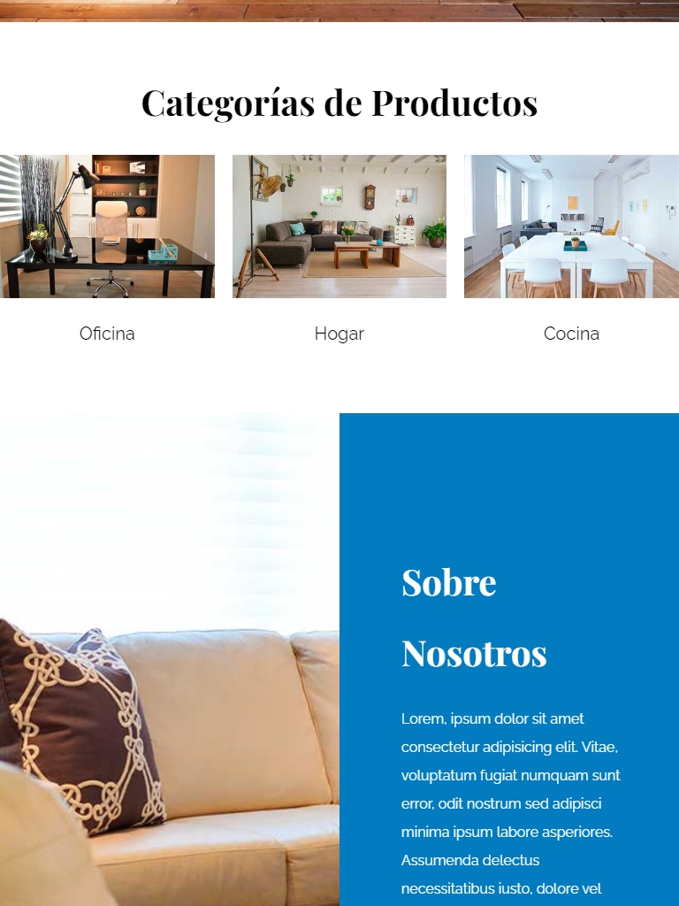

# Proyecto HTML / CSS Tienda de Muebles

## Información

-Diseñar una página web con HTML desde cero responsive.  
-Dar estilo con Css utilizado distintas variables (Grid, FelxBox, MediaQuery)
  

## Tablet

  
  
  
  
  

 

## Phone
  

      
      
      
  
